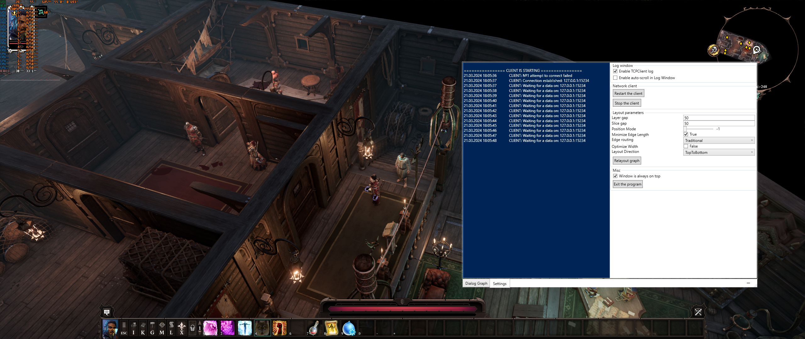

# Dialog Graph for Divinity Original Sin 2
This project allows you to view real-time dialogs with NPCs in the form of a dialog graph or map.  
Thanks to the visualization of the dialog map, you can view all available dialog options (for any NPC with whom you are currently in dialog) and the requirements for them.
## Usage
Usage details:
* The application should be launched after the game has started  
* The game should be run in `Borderless Windowed Mode` (graphics setting) so that the WPF application can render over the game
* [InjectedLogic](../InjectedLogic) uses an optional config located at the game's executable path, for example: `..\Steam\steamapps\common\Divinity Original Sin 2\DefEd\bin\DialogGraphMod\modConfig.json`
> [!NOTE]
> All config options can be viewed in the `Config.cs` file in [InjectedLogic](../InjectedLogic)
---
* [DialogGraph](../DialogGraph) uses an optional config located at: `..\this_application_folder\DialogGraphMod\config.json`
> [!NOTE]
> All config options can be viewed in the `Config.cs` file in [DialogGraph](../DialogGraph)

* If you need to add a new localization for dialogs, you should unpack the game archive of the desired localization, take the .xml file and place it next to `config.json`. After that you should write the name of the file in `config.json`, for example: `"localizationFileName": "german.xml"`
## Screenshots
  

## Technical details
* [Main](../Main) - injects .NET Runtime into Divinity Original Sin 2. After the injection, .NET Runtime loads the .dll file of [InjectedLogic](../InjectedLogic). After that, [Main](../Main) launches [DialogGraph](../DialogGraph)
* [InjectedLogic](../InjectedLogic) - .dll that sets several hooks in the game's native (assembly) code, then using them collects all necessary information about the current dialog and sends it to [DialogGraph](../DialogGraph)
* [DialogGraph](../DialogGraph) - WPF project receives dialog data from [InjectedLogic](../InjectedLogic), then finds the current dialog file, parses it, creates a visual dialog graph and then displays it
### Simplified visualization of data flow
  
### Installation for development
No special steps are required, just installing the dependencies. In case of problems, deleting the `obj` folder and using the `dotnet restore` command may help.
## Acknowledgments
* [InjectDotnet](https://github.com/Mbucari/InjectDotnet)
* [GraphShape](https://github.com/KeRNeLith/GraphShape)
* [Reloaded.Hooks](https://github.com/Reloaded-Project/Reloaded.Hooks)
* [Reloaded.Memory.SigScan](https://github.com/Reloaded-Project/Reloaded.Memory.SigScan)
* [System.IO.Hashing](https://www.nuget.org/packages/System.IO.Hashing)
* [Newtonsoft.Json](https://github.com/JamesNK/Newtonsoft.Json)
* [Draw.io](https://app.diagrams.net/)
## Disclaimer
This project is not affiliated with Larian Studios or Divinity Original Sin 2. It is a fan-made tool intended for creative purposes.